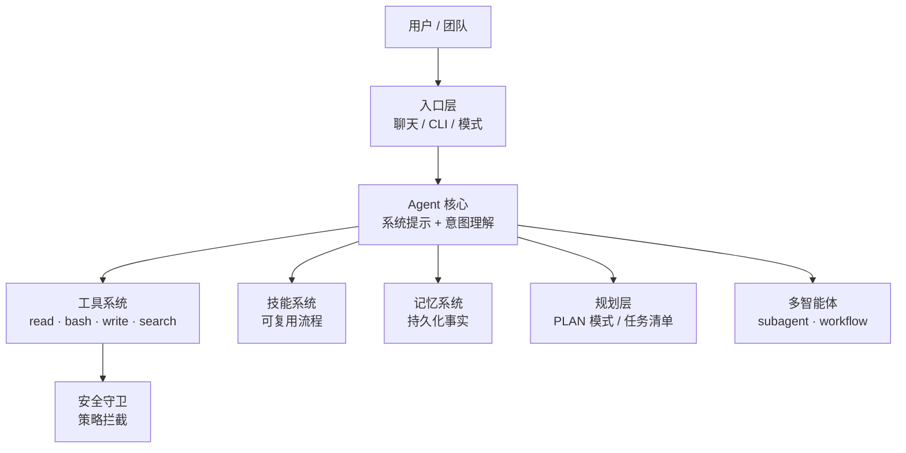

# Pi Agent 架构概览

> 一篇演示文档，用于验证「编辑 → push → 站点自动更新」的发布流程。本文简述 **Pi Agent**（本团队使用的 AI 智能体）的整体架构。

## 它是什么

Pi Agent 是一个以 **系统提示（system prompt）+ 工具调用（tool calling）** 为核心驱动的 AI 智能体。它通过一套工具与外界交互：读文件、执行命令、搜索网络、调用 MCP、派发子任务等，并遵循「先计划、后执行」的工作流。

## 分层架构



### 1. 入口层
- 支持聊天对话、命令行、以及 **NORMAL / PLAN / SPEC / TEAM** 等模式。
- 每种模式约束 agent 的行为：例如 PLAN 模式要求先写计划、经批准后再实施。

### 2. Agent 核心
- 由系统提示定义角色、规则与安全策略。
- 通过「工具调用」完成实际操作，而非自由生成。

### 3. 工具系统
- **基础工具**：`read`（读文件）、`bash`（执行命令）、`write`/`edit`（写文件）。
- **检索工具**：`web_search`、`fetch_content`、`source_check`。
- **MCP 网关**：`mcp` / `mcpScript` 动态接入外部工具服务器。
- **派发工具**：`subagent`、`workflow` 派发子任务。

### 4. 技能系统
- `skill_manage` 把「如何做某事」沉淀为可复用的过程（SKILL.md）。
- 技能按 **global / project** 作用域保存，跨会话复用。

### 5. 记忆系统
- `memory_add` / `memory_search` 存取持久化记忆（用户偏好、项目事实、失败教训）。
- 目标分为 `user` / `memory` / `project` / `failure` 四类。

### 6. 规划层
- 复杂任务先进 **PLAN 模式**：侦察 → 写计划 → `show_plan` 审批 → 分阶段实施。
- 计划写入 `.context/todo.md`，按 Phase 推进并跟踪。

### 7. 多智能体协作
- `subagent_create_batch` 并行侦察、`workflow` 编排子任务。
- 支持 Commander 任务/会话/依赖等团队级编排。

### 8. 安全守卫
- 内置安全策略实时监控工具调用，拦截破坏性命令（如 `rm -rf`）、提示注入、敏感信息外泄。
- 被拦截时 agent 需向用户说明并改用安全替代方案。

## 一次典型任务的数据流

```text
用户请求 → 理解意图 →（复杂则 PLAN 侦察）
→ 调用工具获取上下文 → 制定分阶段计划 → 审批
→ 逐 Phase 实施（工具调用）→ 提交 → 完成报告
```

## 相关笔记
- [[index]] 知识库首页
- 领域知识：[[00.研发索引]]
