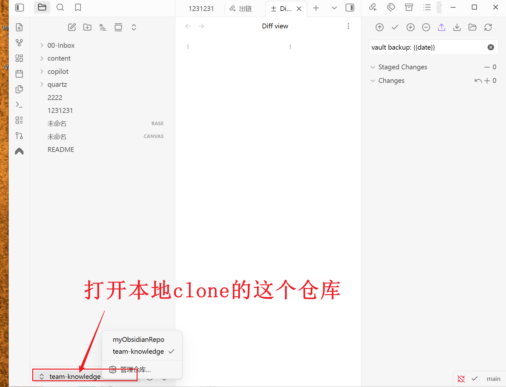
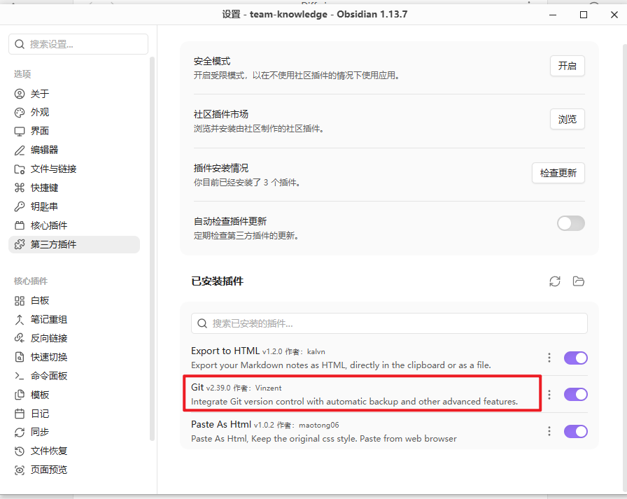
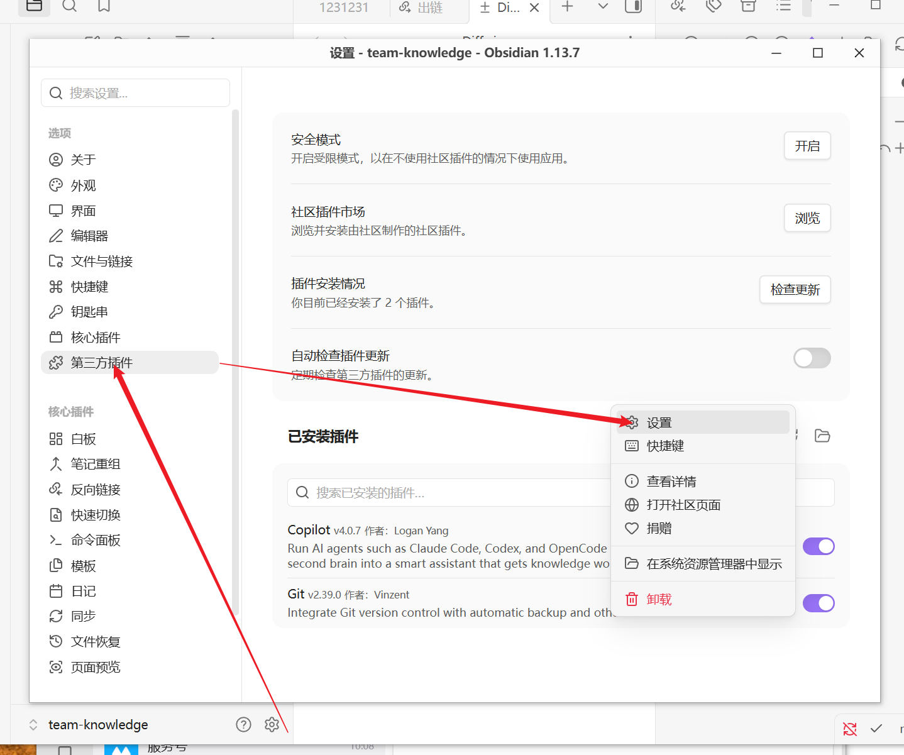
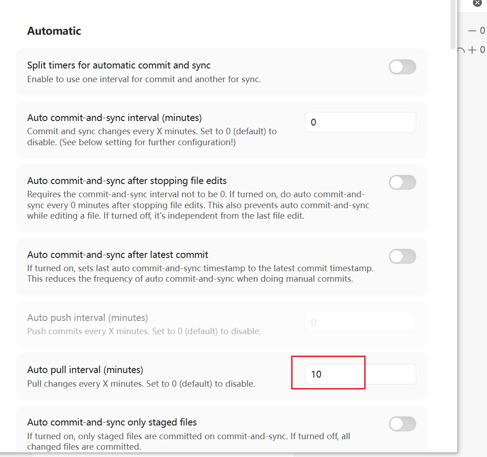
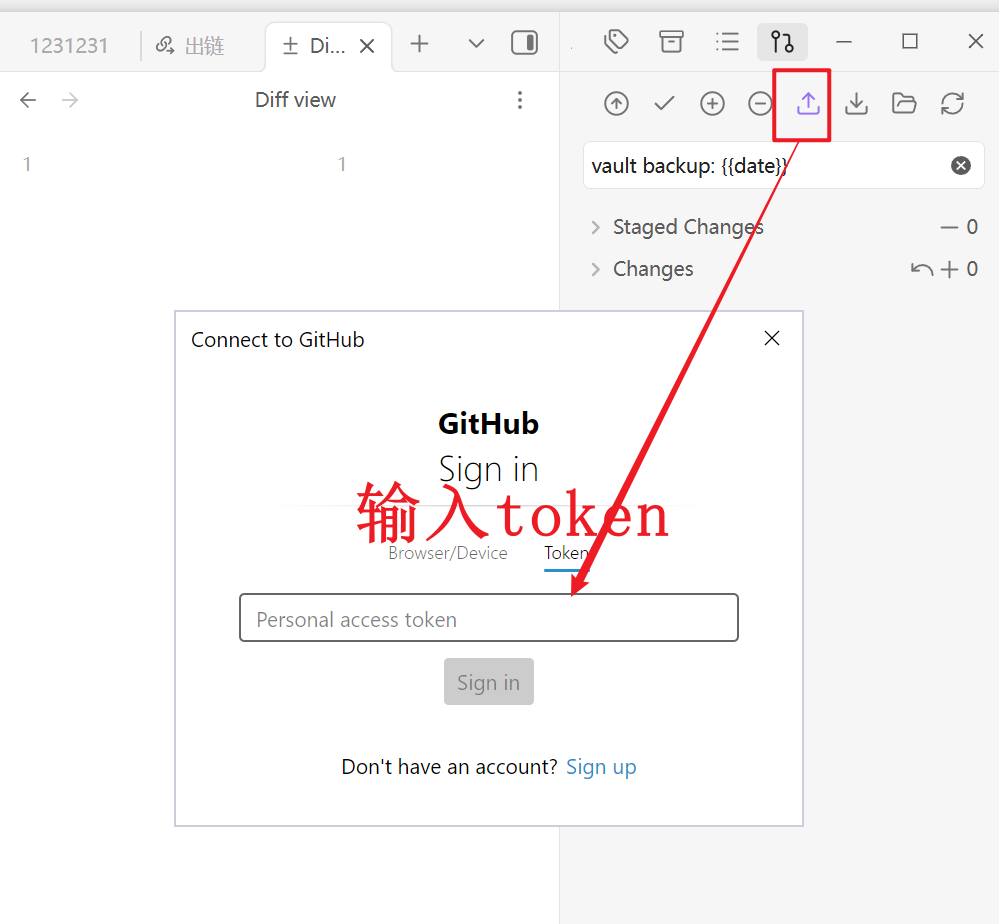
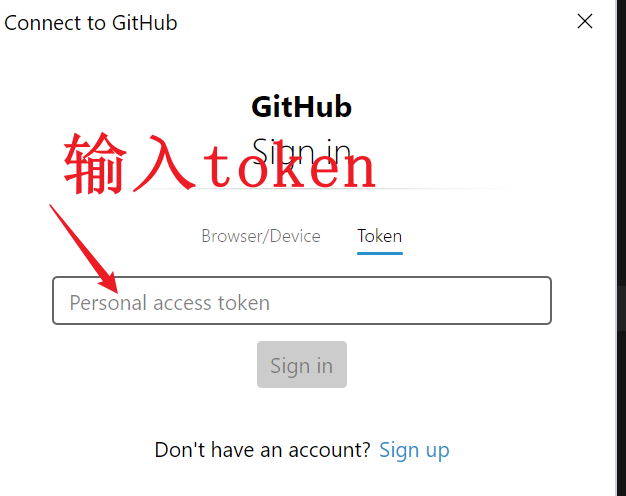

## Step1，安装obsidian



打开clone的这个仓库。


## Step1，安装obsidian 插件

obsidian随便安装哪个git插件都行。

我安装的是 Git。 也没有配置什么。







## Step2. push提示输入token

关掉代理，obsidian上点加个文件commit，然后点push（或者使用tortiseGit在文件目录里点commit再push也行）。







## Step3，输入token，以后就不用输入了。

```
 github不让push这个。
```


push成功。以后直接在obsidian上git操作就行。
