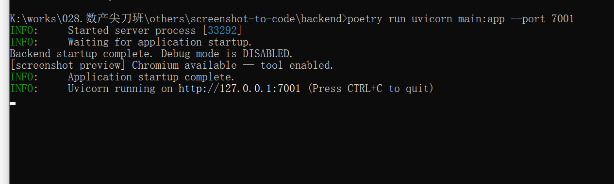
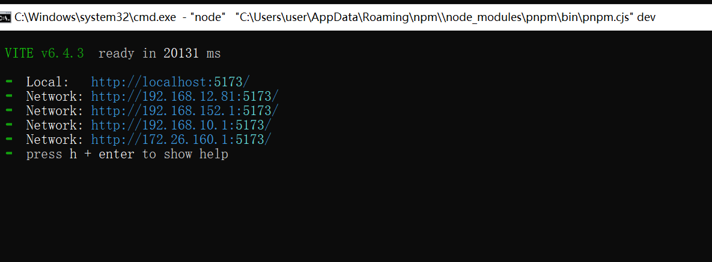
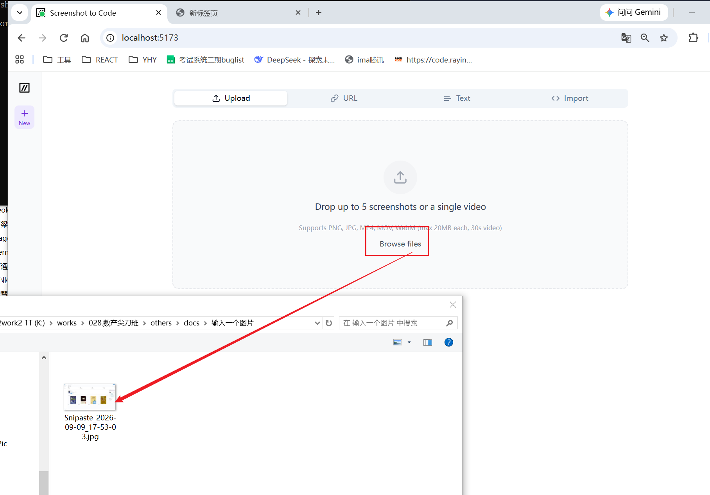

# screenshot-to-code 本地部署（原生手动方式，官方推荐）

> 在线托管版是付费订阅；本地版**不收取项目本身费用，但你自己要承担大模型API的计费**（OpenAI/Gemini/Claude，按token计费）

## ✅ 前置依赖（先装好）

1. Git

2. Python 3.10 ~ 3.13（不要3.14，有兼容问题）

3. Node.js ≥18，同时装好 yarn / pnpm（二选一即可）

4. 至少一个API Key（**三选一**）：

   - GEMINI_API_KEY（谷歌Gemini，推荐，图片素材提取效果最好，免费额度够用测试）

   - OPENAI_API_KEY（GPT4o）

     支持中转站。

     ```
     backend/.env
     # 其他provider，model-name不用写，atom.config才认，.env只认下面两个。
     OPENAI_API_KEY=sk-cba2f7291000cxxxc
     OPENAI_BASE_URL=https://code.rayinai.com/v1
     ```

     

   - ANTHROPIC_API_KEY（Claude）

> 可选：REPLICATE_API_KEY，用来做抠图、图片编辑，没有也能基础跑

## 1. 拉取源码

```bash
git clone https://github.com/abi/screenshot-to-code.git
cd screenshot-to-code
```

## 2. 启动后端（新开终端A）

```bash
# 进入后端目录
cd backend

# 安装 poetry（没有就执行这行）
pip install --upgrade poetry

# 创建 .env 写入密钥（Windows用记事本新建backend/.env也行）
# 至少写一个，推荐Gemini
# 我只有中转站的api key。能便宜点。
OPENAI_API_KEY= 略。
OPENAI_BASE_URL=https://code.rayinai.com/v1 # 这里写你的中转站。

# 安装python依赖
poetry install

# 安装Playwright Chromium（用于页面预览，很重要）
poetry run playwright install chromium

# 启动后端，端口7001
# poetry run uvicorn main:app --reload --port 7001 # --reload加上就起不来Playwright
poetry run uvicorn main:app --port 7001 #注意不要加 --reload 
```

> 后端启动成功提示：`Uvicorn running on http://127.0.0.1:7001`



## 3. 启动前端（新开终端B，不要关闭终端A）

```bash
# 回到项目根目录，进入前端
cd frontend

# 安装依赖（yarn 或 pnpm任选其一）
pnpm install

# 启动前端开发服务
pnpm dev
```

> 前端成功后：访问 http://localhost:5173




## 4. 使用

打开浏览器访问 `http://localhost:5173`

- 右上角齿轮图标：**也可以不在.env写key，直接在网页界面填写API密钥**，方便切换多个key
- 上传截图，选择目标技术栈：HTML+Tailwind / React / Vue 等，点Generate Code生成




# 🐳 备选：Docker Compose 一键部署（新手更省事）

前提：电脑装好 Docker Desktop

```bash
git clone https://github.com/abi/screenshot-to-code.git
cd screenshot-to-code

# 在项目根目录创建.env，填入API KEY
echo "GEMINI_API_KEY=你的key" > .env

# 构建并启动
docker compose up -d --build
```

同样访问：`http://localhost:5173`

```bash
# 查看日志排错
docker compose logs -f backend
# 停止服务
docker compose down
```

